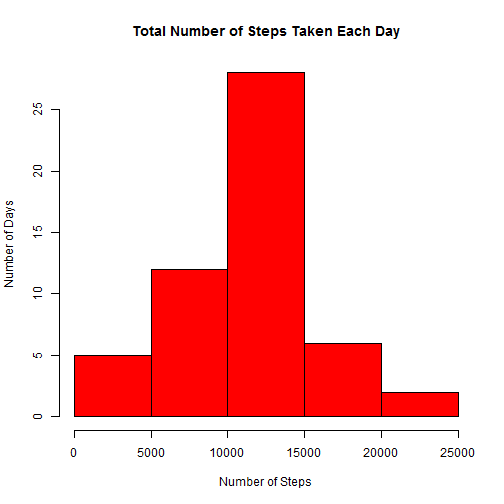
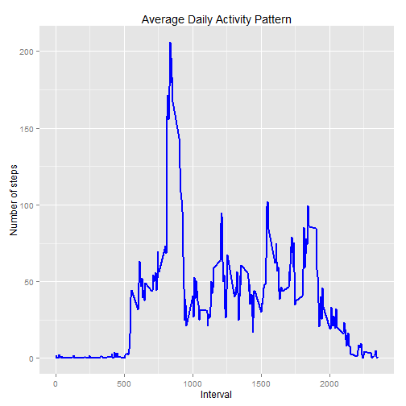
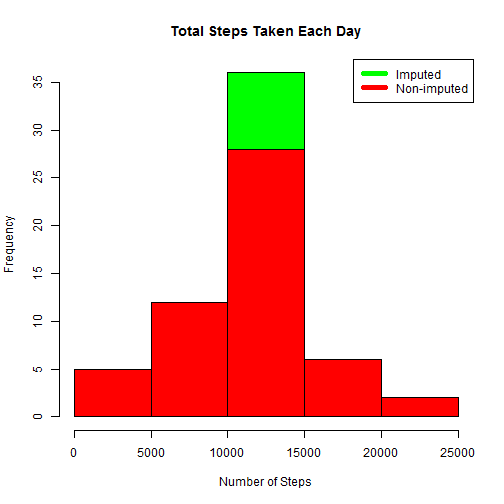
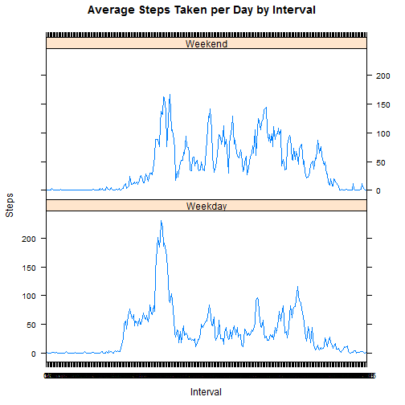

## Introduction
This report contains the results of Coursera's Reproducible Research Peer Assessment 1 assigment work.

This assignment makes use of data from a personal activity monitoring device. This device collects data at 5 minute intervals throughout the day. The data consists of two months of data from an anonymous individual collected during the months of October and November in 2012 and include the number of steps taken in 5 minute intervals each day.

This report answers the questions detailed below in a single R markdown document that will then be processed by knitr and finally transformed into an HTML file.


## Set global options and load relevant libraries


```r
library(lattice)
library(ggplot2)
```

```
## Warning: package 'ggplot2' was built under R version 3.1.3
```

```
## Use suppressPackageStartupMessages to eliminate package startup messages.
```

```r
library(knitr)
opts_chunk$set(echo=TRUE,results="show",cache=TRUE)
```

## Loading and preprocessing the data

The data for this assignment can be downloaded from the course web site:

Dataset: Activity monitoring data [52K]
The variables included in this dataset are:

* steps: Number of steps taking in a 5-minute interval (missing values are coded as NA)
* date: The date on which the measurement was taken in YYYY-MM-DD format
* interval: Identifier for the 5-minute interval in which measurement was taken

The dataset is stored in a comma-separated-value (CSV) file and there are a total of 17,568 observations in this dataset.

Loading the data (i.e. read.csv())

```r
data <- read.csv("activity.csv", header = TRUE, sep = ",", colClasses=c("numeric", "character", "numeric"))
```

Process/transform the data into a format suitable for our analysis

```r
data$date <- as.Date(data$date, format = "%Y-%m-%d")
data$interval <- as.factor(data$interval)
```

## What is mean total number of steps taken per day?
Calculate the total number of steps taken each day and make a histogram

```r
stepsTakenPerDay <- aggregate(steps ~ date, data, sum)
hist(stepsTakenPerDay$steps, main = paste("Total Number of Steps Taken Each Day"), col="red", xlab="Number of Steps", ylab="Number of Days")
```

 

Calculate and report the mean and median of the total number of steps taken per day


```r
meanSteps <- mean(stepsTakenPerDay$steps)
medianSteps <- median(stepsTakenPerDay$steps)
```

The mean is 10766 and the median is 10765


## What is the average daily activity pattern?

Firstly, we aggregate the steps by intervals of 5-minutes and then convert the intervals as integers to get new data frame called stepsPerInterval.


```r
stepsPerInterval <- aggregate(data$steps, by = list(interval = data$interval), FUN=mean, na.rm=TRUE)
stepsPerInterval$interval <- as.integer(levels(stepsPerInterval$interval)[stepsPerInterval$interval])
colnames(stepsPerInterval) <- c("interval", "steps")
```

We then make a time series plot of the 5-minute interval (x-axis) and the average number of steps taken, averaged across all days (y-axis)


```r
ggplot(stepsPerInterval, aes(x=interval, y=steps)) +   
        geom_line(color="blue", size=1) +  
        labs(title="Average Daily Activity Pattern", x="Interval", y="Number of steps")
```

 

Next we find Which 5-minute interval, on average across all the days in the dataset, contains the maximum number of steps?


```r
maxInterval <- stepsPerInterval[which.max(stepsPerInterval$steps), 1]
```

The 835th interval has maximum 206 steps.


## Imputing missing values
Firstly, we calculate and report the total number of missing values in the dataset (i.e. the total number of rows with NAs)

```r
missing <- sum(!complete.cases(data))
```
Total number of missing values = 2304

Using a simple strategy, missing values are imputed by replacing with the average for each interval. For example, if the interval is missing on a particular date, the average for that interval for all days will replace "NA". This then create a new dataset that is equal to the original dataset but with the missing data filled in.


```r
dataImputed <- transform(data, steps = ifelse(is.na(data$steps), stepsPerInterval$steps[match(data$interval, stepsPerInterval$interval)], data$steps))
```

Finally, we make a histogram of the total number of steps taken each day and Calculate and report the mean and median total number of steps taken per day.


```r
stepsTakenPerDayImputed <- aggregate(steps ~ date, dataImputed, sum)
hist(stepsTakenPerDayImputed$steps, main = paste("Total Steps Taken Each Day"), col="green", xlab="Number of Steps")
hist(stepsTakenPerDay$steps, main = paste("Total Steps Each Day"), col="red", xlab="Number of Steps", add=T)
legend("topright", c("Imputed", "Non-imputed"), col=c("green", "red"), lwd=5)
```

 

Calculate new mean and median for imputed data.

```r
meanStepsImputed <- mean(stepsTakenPerDayImputed$steps)
medianStepsImputed <- median(stepsTakenPerDayImputed$steps)
```
The non-imputed mean is 10766 and the median is 10765

The imputed mean is 10766 and the median is 10766

From the above, we can see that there are more steps in the imputed data.


## Are there differences in activity patterns between weekdays and weekends?
Using a panel plot containing a time series plot (i.e. type = "l") of the 5-minute interval (x-axis) and the average number of steps taken, averaged across all weekday days or weekend days (y-axis).


```r
weekdays <- c("Monday", "Tuesday", "Wednesday", "Thursday", "Friday")

dataImputed$WkdOrWke = as.factor(ifelse(is.element(weekdays(as.Date(dataImputed$date)),weekdays), "Weekday", "Weekend"))

stepsPerIntervalImputed <- aggregate(steps ~ interval + WkdOrWke, dataImputed, mean)

xyplot(stepsPerIntervalImputed$steps ~ stepsPerIntervalImputed$interval|stepsPerIntervalImputed$WkdOrWke, main="Average Steps Taken per Day by Interval",xlab="Interval", ylab="Steps",layout=c(1,2), type="l")
```

 


Observation: On weekdays, the peak occurs earlier, while on weekends there are more activity (i.e. more steps).
